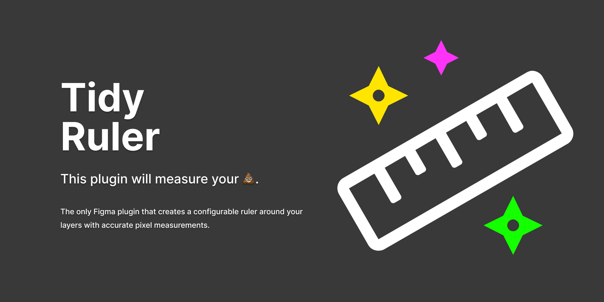

# Tidy Ruler

Tidy Ruler is a Figma plugin that can wrap your figma layers in a configurable ruler with accurate pixel measurements

## Getting Started

When you first open the plugin, you are presented with a set of pre-defined parameters that can be used as-is to show you what is possible. 

## Options

| Parameter | Description | Value |
|----------|-------------|------|
| `Increment` | The increment of each ruler mark in pixels. | 8, 10 |
| `Offset` | The hierarchy levels in which your components will be organized. | Number in pixels that you want the ruler to be offset from the top left corner of the layer. |
| `Color` | Color of ruler. | HTML Color Picker |
| `Opacity` | Opacity of ruler. | 0-100 |

## Found a bug or have an idea?

This is a team of **one**, but if you have any good ideas or constructive feedback, please do not hesitate to share your thoughts [by creating a new issue](https://github.com/cross-team/figma-ruler/issues/new) - screen captures are welcomed.

## Show your support

If you find this plugin useful, feel free to [buy me a 🍺](https://www.patreon.com/mpaiva) at my Patreon page. Thanks! 🙏
 
## Contribute
- Run `yarn` to install dependencies.
- Run `yarn build:watch` to start webpack in watch mode.
- Open `Figma` > `Plugins` > `Development` > `New Plugin...` and choose manifest.json file from this repo.
- Create a Pull Request for your branch
